# Honeypot Manual

The Honeypot is integrated with our Threat Intel API Service. Samples received in the honeypot are analyzed using the Threat Intel Service to categorize the verdict. To enable this service license key is required.

You can obtain a free Threat Intel license key from the CySecurity page.

> **Note: The free license key will have a limit of 1000 hash checks and 100 file uploads per day.**

## Obtain Free License Key

- Open your web browser and enter the following address: <https://cysecurity.co/panel/keys/request>.

- This will take you to the License request page, where you can provide your email address to receive an activation link.

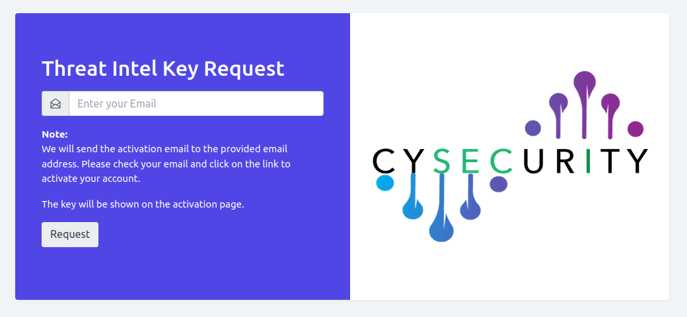

- Then you will get the activation link over email.

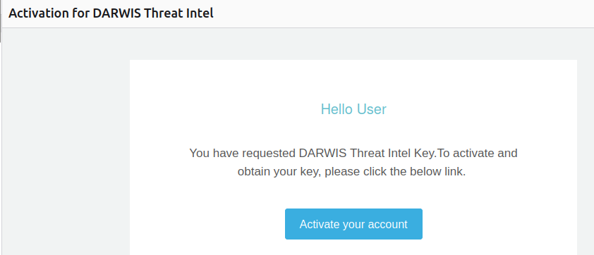

- Once you click on `Activate your account`, you can view the License key on the 'success page.'

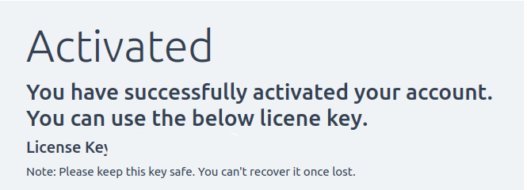

> **Note: Each email address will receive one license key. Please store and keep your license key safely, as it cannot be recovered if lost. Once a license key has been used, it cannot be reused.**

## Accessing the Panel

On your desktop, open a browser (Firefox or Chrome, recommended: Firefox) and enter the following address. https://localhost:12443

- You will get a self-signed certificate error message.  Click the `Advanced` button and then click the `Accept the Risk and Continue` button.

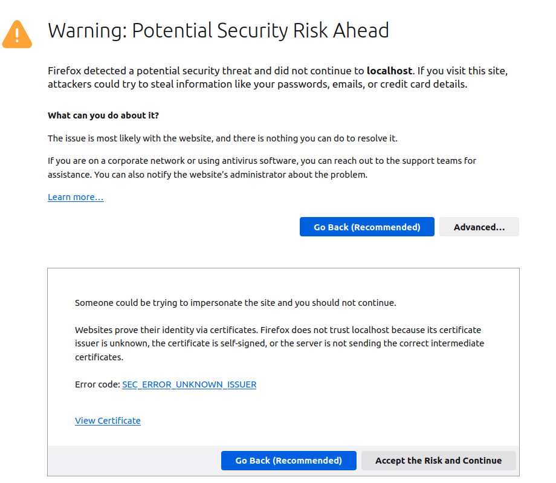

- This will take you to the setup page. Click the `Setup` button, which will perform the base setup for the panel. If successful, it will take you to the license activation page.

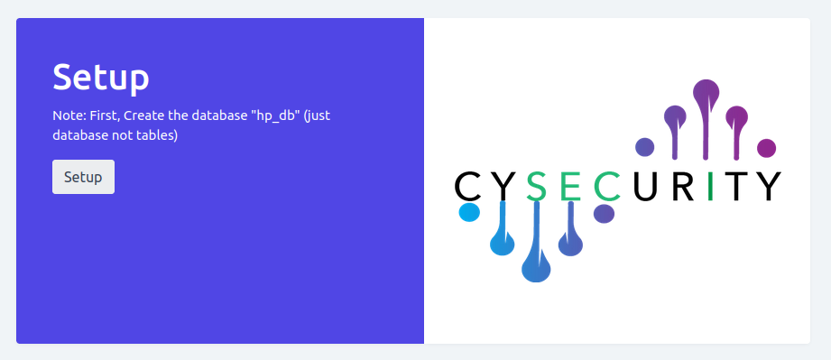

- On the activation page enter the license key you received.

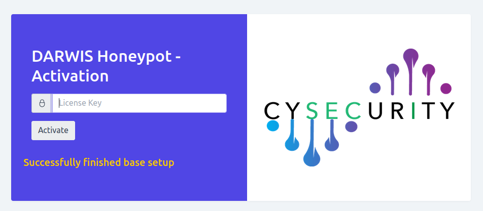

## User Creation & Login

Once the license key is successfully validated, the panel will show the customer creation page. Fill the form with username, password, and email.

**Note: The email address is just for user creation. It is not used or uploaded to any external server.**

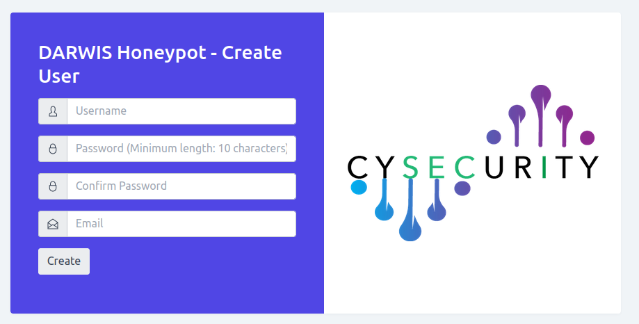
 
Once the account is created, you will be redirected to the login page. Enter your Username and password to log in,

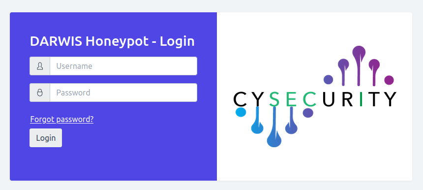

Once you log in, the Honeypot panel can be viewed.

## Honeypot Panel

The Honeypot analyses the incidents with our threat intel and categorizes each incident into the following types:

- Whitelist: Trusted and safe samples.
- Safe/Clean: The sample is found to be safe at the moment.
- Malicious: Known threat samples.
- New Malware: Represents threats that have not been previously identified but are detected now.

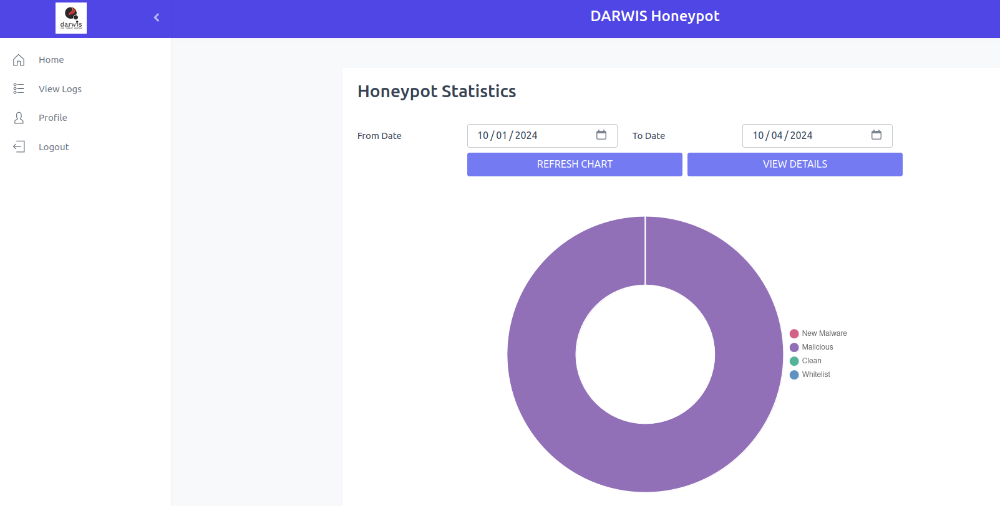

You can filter the statistics by choosing From date and To date, then click on the `Refresh Chart` option to see details in different date ranges.

## Honeypot: View details/ View logs

By clicking the `View Details` button on the home page or clicking on `View logs` in the side menu, you can see the honeypot logs including Incident ID, Incident Time, SHA256, and Verdict.

You can filter the logs by choosing the verdict from the Search by Verdict list menu, then click on Filter to show the entries.

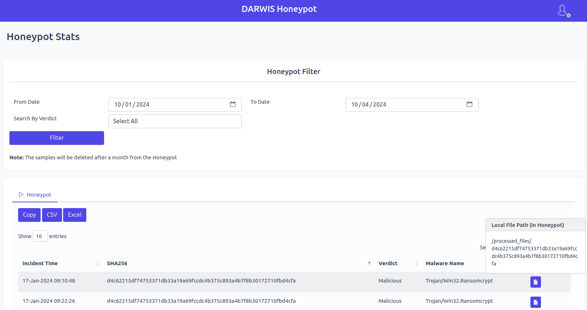

- You can copy the logs, and download the logs in CSV format and Excel format.
- By clicking the icon under the Action menu, you can view the directory path where the malware sample is located.

## Profile  

You can view your profile information which includes name, username, and email address.

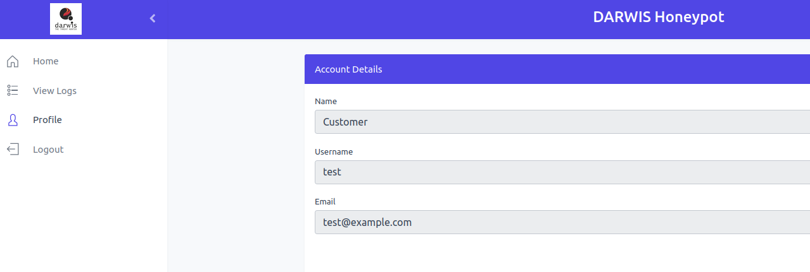

## Logout

You can click on the `logout` option to successfully logout from the panel. 

## Forgot Password

In case the password for the panel has been forgotten, you can click the `Forgot Password` link on the login page to reset it.

In the forgot password page, you can reset the password by providing the Username and License Key.

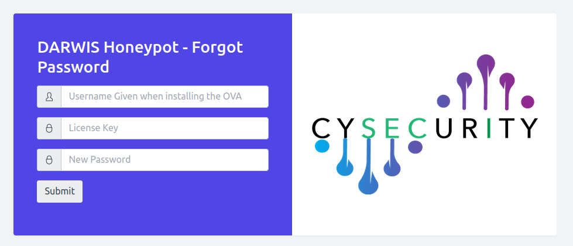

